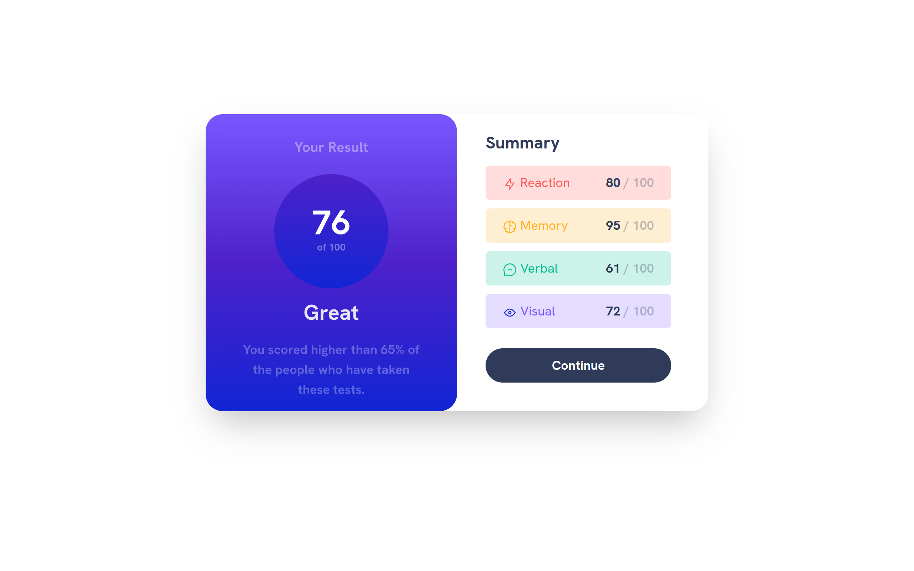
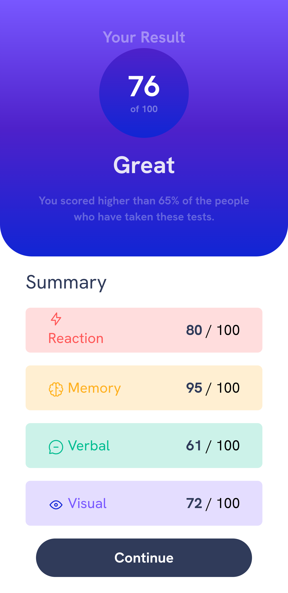

# Challenge 1

Expected Design shown below :


# My Results For Frontend Mentor Summary Result Challenge

Desktop



Mobile



Built Using HTML and Tailwind CSS

If you wish to extend the project use the command

```bash
npx tailwindcss -i ./index.css -o ./dist/output.css --watch
```
